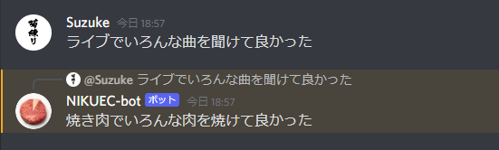

# NIKUEC-bot
Chrome拡張機能の[NIKUECコンバーター](https://github.com/Suzukeh/NIKUEC-Converter)をDiscord Botにしてみました。

詳しいことはコンバーターの記事を見てください。<br>
[誰でもカンタン！ クソコラ拡張機能の作り方](https://suzuke.dev/posts/reprints/nikuec-converter/)


**招待リンク**<br>
https://discord.com/api/oauth2/authorize?client_id=944586587767971871&permissions=274877910016&scope=bot

## 機能

### !niku コマンド
コマンドのあとに入れたテキストを焼き肉にします。

```
!niku foo
```


### 条件が揃ったら勝手に置換

適当な条件にあったメッセージがあったら勝手に焼き肉にしてリプします。



<br>


ここらへんの条件が知りたい人 (そんなやついない) は `discordbot.py` を見てくれ～

## 構成

この記事に従ってHerokuで動かしています。<br>
[Discord Bot 最速チュートリアル【Python&Heroku&GitHub】](https://qiita.com/1ntegrale9/items/aa4b373e8895273875a8)

## 改善

こういう焼き肉化はどうよみたいなのがあったらIssueでもTwitterでもなんでも言ってください。

例)

> "者"を"肉"にするの良くない？

> 却下